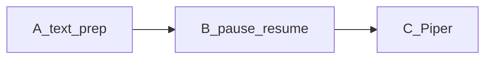

# IDEA-002 — Cursor TTS: таблицы, pause/resume, Piper

## Цель

Меньше ждать озвучку и удобнее слушать длинные ответы: нормальный текст (таблицы/схемы), пауза без сброса очереди, быстрый локальный Piper.

## Не в scope

- IndexTTS2 / Qwen (для IDEA-001)  
- Стрим озвучки пока Agent ещё пишет  
- Seek внутрь одного wav  
- Перенос YouTube UI (IDEA-010)

## Уже есть

- [`Cursor_TTS/`](../../Cursor_TTS/) — Edge + Silero + **Piper**, демон, панель, хук  
- text_prep: таблицы, стрелки «затем», mermaid → «есть схема»  
- pause/resume: `speak_edge.py --pause-toggle`, Ctrl+Shift+P, кнопка «Пауза»  
- stop по-прежнему чистит очередь (Ctrl+Shift+X)

## Фазы



### A — text_prep
- Стрелки `->` / `=>` / `→` → « затем »
- Таблицы: строка = предложение; короткие куски в демоне
- ````mermaid` → «Есть схема, смотри в чате.»

### B — pause / resume
- Демон: `pause` / `resume` / `pause_toggle` (не чистит очередь)
- MVP: продолжение со **следующего целого куска**
- stop = очистка очереди + сброс pause

### C — Piper
1. `pip install piper-tts` + `python download_piper_voice.py ru_RU-dmitri-medium`
2. Прототип: [`piper_prototype.py`](../../Cursor_TTS/piper_prototype.py)
3. `engine: "piper"` + `piper_model` в конфиге / панели
4. Очередь / stop / pause совместимы

## Добавка по UX пауз (после B, не блокирует)

- Умные `pause_rules` (разные ms для кода vs текста) — мелкая добавка сверху `pause_ms`.

## Готово когда

- Таблица не пулемёт; стрелки не «потом»; схема не читается как код  
- Можно замолчать и продолжить не с начала ответа  
- В панели выбирается Piper; после warmup первая фраза приемлема по latency
