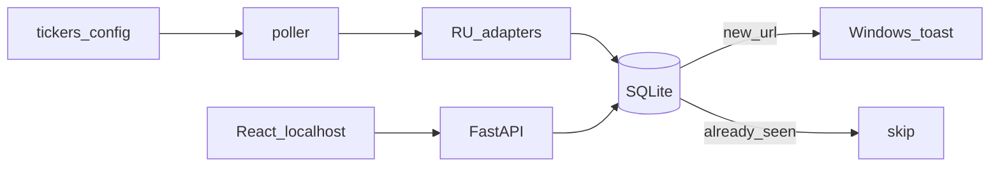

# IDEA-003 — Новостник портфеля

## Цель

Список тикеров → периодический сбор **RU-новостей** → дедуп в SQLite → **Windows toast** + локальный UI (**React** на FastAPI). Без облачного хоста в MVP.

## Зачем

Не сидеть вручную по вкладкам. Короткий дайджест «что вышло по моим бумагам» на ноуте.

## Зафиксированные решения (2026-08-15)

| Вопрос | Выбор |
|--------|--------|
| Уведомления | **Windows toast** только |
| Телефон / MAX / VK / Telegram | **пас** (MAX нет в App Store; VK на iPhone не живёт; TG не используем) |
| Источники | **RU**: Smart-Lab, сайты эмитентов (IR/пресс), Investing.com RU и похожие; адаптеры по тикеру |
| Стек бэка | **Python 3.12+**, **FastAPI**, **SQLite** (+ SQLAlchemy 2 по возможности) |
| Стек фронта | **React** (Vite), localhost → API FastAPI |
| Дедуп | SQLite: уникальный ключ по **URL** (одна ссылка = одно уведомление) |
| Хостинг | **localhost** на ноуте; денег на VPS не надо |
| Docker | **позже**, не MVP |
| Брокер / котировки / «купи-продай» | нет |

## Железо / папка

- Windows
- Код: [`Portfolio_News/`](../../Portfolio_News/)
- Промпт агенту: [`Portfolio_News/PROMPT_FOR_AGENT.md`](../../Portfolio_News/PROMPT_FOR_AGENT.md)
- Git: монорепо `DS_Projects`

## Поток

## Этапы

### Этап A — ядро (без красивой морды можно, но API сразу)

1. Каркас пакета, `requirements.txt`, `.gitignore`, `.env.example`, example-тикеры (MOEX: SBER, GAZP, …).
2. SQLite: таблицы tickers / news / seen (или news с unique url).
3. Адаптеры источников (минимум 1–2 рабочих на старте: например RSS эмитента + Smart-Lab или Investing; остальные нарастить).
4. `once` / `watch`: опрос → дедуп → toast.
5. FastAPI: `GET /api/news`, `GET /api/tickers` (и при необходимости CRUD тикеров).

### Этап B — фронт

6. React (Vite) на localhost: лента новостей, список тикеров.
7. README: как поднять backend + frontend.

### Этап C — позже (не блокирует DoD ядра)

- Docker Compose
- Больше источников
- Телефонный канал, если появится рабочий (ntfy и т.п.)

## Дедуп (зачем)

Поллер крутится часто; одна новость висит днями. Без дедупа toast спамит. Храним URL (или hash URL) в SQLite; повтор → тишина.

## Не в scope

- Платный хостинг / публикация в интернет
- Инвест-советы, брокерские API, realtime-котировки
- Смешение с воркспейсом `Инвестиции/`
- MAX / VK / Telegram боты
- Docker в первой поставке

## Готово когда (MVP)

- 2–3 тикера → `watch`/`once` → новая новость = toast, повтор URL = нет toast
- FastAPI отдаёт новости
- React на localhost показывает ленту
- README поднимает стек локально без облака

## Промпт агенту

[`Portfolio_News/PROMPT_FOR_AGENT.md`](../../Portfolio_News/PROMPT_FOR_AGENT.md)
