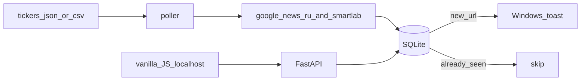

# IDEA-003 — Новостник портфеля

## Цель

Список тикеров → периодический сбор **RU-новостей** → дедуп в SQLite → **Windows toast** + локальный UI на FastAPI. Без облачного хоста в MVP.

## Зачем

Не сидеть вручную по вкладкам. Короткий дайджест «что вышло по моим бумагам» на ноуте.

## Статус (2026-08-16)

**Прототип живой, продукт не закрыт.** Карточка в `IDEAS.md` — **в работе**. Не помечать «готово», пока лента не чистая и `watch` не живёт без ручного тыка.

Код: [`Portfolio_News/`](../../Portfolio_News/). Запуск: `python -m portfolio_news serve` → http://127.0.0.1:8765/

## Зафиксированные решения (2026-08-15)

| Вопрос | Выбор |
|--------|--------|
| Уведомления | **Windows toast** только |
| Телефон / MAX / VK / Telegram | **пас на сейчас** (MAX нет в App Store; VK на iPhone мёртвый; TG не используем). Позже: ntfy или иной канал, который реально пушит на iPhone |
| Источники сейчас | Google News RU RSS + Smart-Lab news RSS |
| Источники план | ещё Investing.com RU, RSS/страницы эмитентов |
| Стек бэка | Python 3.12+, **FastAPI**, **SQLite** + SQLAlchemy 2 |
| Стек фронта | **vanilla JS** с FastAPI (`/` → `static/index.html`). Vite/React в `frontend/` — заготовка, Node на машине не стоял |
| Дедуп | SQLite unique `news.url` |
| Хостинг | localhost, без VPS |
| Docker | позже |
| Тикеры | Snowball CSV → `tickers.example.json` (~50: equity / bond / fund), без qty/PnL |

## Поток

## Сделано (2026-08-15)

Этап A — ядро:

- [x] Каркас: `requirements.txt`, `.gitignore`, `.env.example`, пакет `portfolio_news/`
- [x] Тикеры из Snowball (`tickers.example.json`, ~50). Импорт JSON/CSV → SQLite
- [x] SQLite: `tickers` + `news` с unique URL
- [x] Адаптеры: Google News RU + Smart-Lab RSS (бонды по имени/эмитенту, не по ISIN вслепую)
- [x] CLI: `once` / `watch` / `import-tickers` / `serve`
- [x] Toast (`winotify`) на новую URL; повтор URL → тишина
- [x] FastAPI: `GET /api/health`, `/api/tickers`, `/api/news`, `POST /api/poll`

Этап B — морда:

- [x] UI на localhost: лента + список тикеров (сначала CDN React — пустой экран; заменён на vanilla JS)
- [x] Светлая тема
- [x] Фильтры: Все / Акции / Облигации / Фонды; у акций — сектора (Snowball `category`)
- [x] ETF (GOLD, BCSR) как `kind=fund`
- [x] README: установка и запуск без облака

## Не сделано / дыры (следующий заход)

Пользователь сам: «недочёты, мусор, под телефон можно».

1. **Мусор в ленте** — релевантность, свежесть, бонды без шума
2. **Источники** — Investing.com RU, сайты эмитентов (IR)
3. **`watch` как привычка** — CLI есть, автозапуск с Windows / фоновый демон без ручного `serve` — нет
4. **Toast spam** на полный прогон 50 тикеров — не отлажен UX
5. **Телефон** — когда появится живой канал на iPhone (ntfy и т.п.), не MAX/VK
6. **Vite/Node** — опционально, не блокер
7. **Docker** — позже

## Не в scope

- Платный хостинг
- Инвест-советы, брокер, котировки
- Смешение с воркспейсом `Инвестиции/`
- MAX / VK / Telegram боты (пока канал на телефоне не выбран заново)
- Docker в этой поставке

## Готово когда (ещё не сейчас)

- Лента по бумагам читаемая, не помойка RSS
- `watch` или эквивалент живёт без «вспомнил открыть терминал»
- Новая URL → toast, повтор → тишина (это уже есть)
- UI фильтры работают (это уже есть)

## Промпт агенту

[`Portfolio_News/PROMPT_FOR_AGENT.md`](../../Portfolio_News/PROMPT_FOR_AGENT.md)
