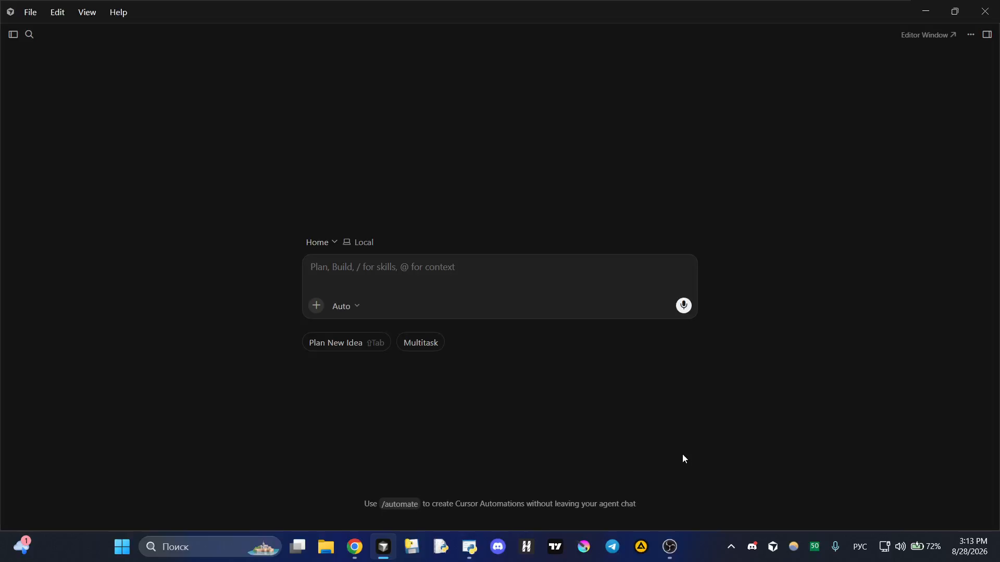
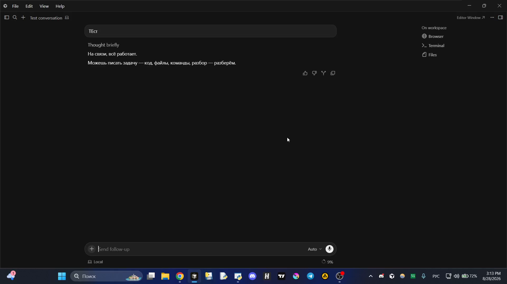
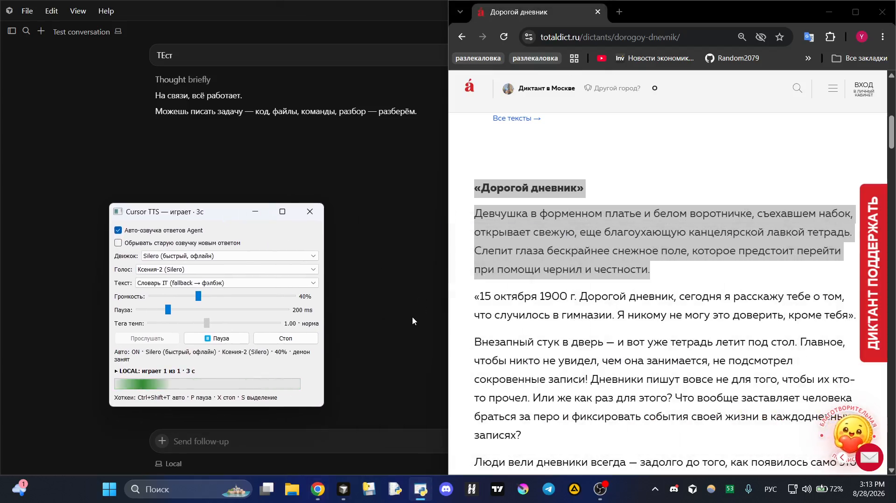

# Cursor TTS

Локальная озвучка ответов **Cursor Agent** на Windows: хук после ответа → фоновый демон → TTS-движок. Панель PyQt, хоткеи AutoHotkey, очередь, пауза на слоге, несколько движков (Tera / Edge / Silero / Qwen).

> Отдельный репозиторий для витрины. Раньше лежало внутри [Portfolio](https://github.com/Random2079/Portfolio) — здесь только TTS.

---

## Демо

**Видео (~24 с):** Cursor Agent отвечает → текст озвучивается → панель показывает «играет», можно выделить фрагмент и прослушать отдельно (Silero).

[Скачать / открыть demo_151324.mp4](docs/demo_151324.mp4)

| Agent + ответ | Панель «играет» | Выделение → озвучка |
|:---:|:---:|:---:|
|  |  |  |

---

## Запустится ли «из коробки» у другого человека?

**Нет, не полностью.** Клон + `pip install` поднимают панель и ручную озвучку.  
**Авто-озвучка ответов агента** требует ещё один шаг: Cursor **не** подхватывает TTS-хуки сам из папки проекта навсегда для всех чатов.

Нужно один раз:

```powershell
powershell -ExecutionPolicy Bypass -File scripts\install_cursor_hook.ps1
```

Скрипт ставит **один глобальный user-hook** в `%USERPROFILE%\.cursor\` (путь к твоему клону пишет в `tts_root.txt`). После этого авто работает **во всех** workspace’ах, пока открыта панель TTS.

| Что | Само? | Что сделать |
|-----|-------|-------------|
| Зависимости Python | нет | `pip install -r requirements.txt` |
| Панель / демон | почти | `Start_TTS_Panel.vbs` |
| Авто после ответа агента | **нет** | `scripts\install_cursor_hook.ps1` + перезапуск Cursor |
| Хоткеи | нет | AutoHotkey + панель/ярлык поднимают `hotkey_tts.ahk` |
| Модели (Tera/Silero/Qwen) | нет | скачиваются/ставятся под выбранный движок |

Почему так: хуки Cursor живут в user/project JSON. Project-хуки в каждом репо легко разъезжаются и ломают парсер (`loop_limit: 0`). Поэтому в репо `hooks.json` **пустой**, канон — один user-hook на машину.

---

## Архитектура

```
Cursor user hook (~/.cursor/hooks/…)
        │
        ▼
  speak_edge.py  ──►  tts_daemon.py  ──►  Tera / Edge / Silero / Qwen / OpenAI
        ▲                      │
   TTS_Panel.py          очередь + warmup
   hotkey_tts.ahk
```

| Компонент | Файл |
|-----------|------|
| Хук (шаблон в репо) | `.cursor/hooks/tts_after_response.py` |
| Хук (живой, после install) | `%USERPROFILE%\.cursor\hooks\tts_after_response.py` |
| Клиент | `speak_edge.py` |
| Демон | `tts_daemon.py` |
| Панель | `TTS_Panel.py` |
| Текст | `text_prep.py` |
| Хоткеи | `hotkey_tts.ahk` |

Контракты Stop / warmup / Авто: [`docs/TZ.md`](docs/TZ.md).

## Движки

| Engine | Роль | Cold start |
|--------|------|------------|
| **tera** | дефолт, качество | 30–90 с |
| **edge** | онлайн, без ключа | ~1–7 с |
| **local** | Silero офлайн | после warmup быстро |
| **qwen** | GPU, лучшее качество | долго |
| **openai** | облако | ключ + VPN |

## Быстрый старт

### 1. Зависимости

```powershell
cd Cursor-TTS
pip install -r requirements.txt
```

### 2. Панель

`Start_TTS_Panel.vbs` / `Start_TTS_Panel.bat` — поднимает демон и прогрев.

### 3. Хук Cursor (один раз на машину)

```powershell
powershell -ExecutionPolicy Bypass -File scripts\install_cursor_hook.ps1
```

Перезапусти Cursor. Открой панель. Авто должно работать в любом проекте.

Если перенёс папку клона — запусти install ещё раз (обновит `tts_root.txt`).

### 4. Горячие клавиши

| Комбинация | Действие |
|------------|----------|
| `Ctrl+Shift+T` | авто ON/OFF |
| `Ctrl+Shift+P` | пауза / продолжить (тот же слог) |
| `Ctrl+Shift+X` | стоп: речь + очередь |
| `Ctrl+Shift+S` | озвучить выделение |

## Настройки

`tts_config.json` — движок, голос, громкость, пауза между кусками.  
OpenAI: `.env` (`OPENAI_API_KEY=...`).

## Отладка

| Что | Где |
|-----|-----|
| Хук | `%TEMP%\cursor_tts_hook.log` |
| Озвучка | `tts_debug.log` |
| Демон | `python speak_edge.py --restart-daemon --warmup` |

Ищи в логе хука: `Hook invoked (user-global)` → `TTS auto queued`.  
Если `hook stop ignored (status=completed)` — норма, речь не рвётся.

## Тесты

```powershell
python -m unittest test_tts_playback.py test_text_prep.py -v
```

---

Pet-project; форкай с пониманием, что модели и ключи — на тебе.
