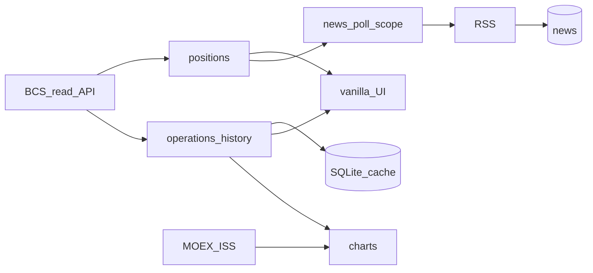

# TZ — Portfolio_News (IDEA-003)

**Карточка:** [`IDEAS.md`](../../IDEAS.md) → IDEA-003  
**План (зеркало):** [`.cursor/plans/IDEA-003-portfolio-news.md`](../../.cursor/plans/IDEA-003-portfolio-news.md)  
**Дата bootstrap 020:** 2026-08-25 · **апдейт «свой БКС»:** 2026-08-25

## Цель

Локальный терминал под **свой** портфель: новости по бумагам + сырой MOEX + **БКС read-only** (позиции, история сделок/покупок, простые графики и цифры с API). Без облака в MVP. **Не** инвест-консультант и **не** торговый бот.

## MVP / слои

### Уже есть

| Слой | Статус | Описание |
|------|--------|----------|
| A | ✅ | Каркас: FastAPI, SQLite, тикеры, RSS, CLI, toast, UI + фильтры |
| B | ✅ | Опрос по scope; фоновый poll; digest-toast |
| C | ✅ | Сырой MOEX: котировки / дивы / купоны |
| D | ✅ | БКС read-only каркас: текущие позиции `/api/holdings` |

### Новостной хвост (не блокер БКС)

| Слой | Статус | Описание |
|------|--------|----------|
| E | ⬜ | UI polish ленты (live во время poll; купоны human) — **низкий приоритет** |
| F | ⬜ | ИИ-чистка шума новостей |
| G | ⬜ | Авто-watch / Task Scheduler |
| H | ⬜ | Телефон (ntfy…) |
| I | ⬜ | Investing / эмитенты |
| J | ⬜ | Docker — только по просьбе |

### Трек «свой БКС» (сейчас в фокусе) — маленькие шаги

| Слой | Статус | Описание |
|------|--------|----------|
| K0 | ✅ | Токен + список = **только БКС**; UI-главная = Snowball-dashboard (`/`). Подтверждено 2026-09-11 |
| K1 | ✅ | **История операций/сделок**: `/api/operations` + таблица на `/`. Live BCS: `POST …/trade-api-bff-trade-details/api/v1/trades/search` (не `bff-operations` — там Angie 404) |
| K2 | ✅ | Кэш истории в SQLite (`bcs_operations`, дедуп по deal_id); `/api/operations` отдаёт кэш, live → upsert при `force` / пустой базе |
| KA | ✅ | **Дневная атрибуция:** стоимость + %/₽ за день + топ бумаг («Кто двинул день»). `/api/day` + KPI на `/` (MOEX day × qty) |
| KB | ✅ | **Смотрю (1 бумага) / Остальное:** эксклюзивный Focus; клик в «Кто двинул день» → разбор; toast/новости про одну |
| K3 | ✅ | **Графики**: цена + маркеры сделок — `/api/chart/{ticker}` + блок на `/` (Chart.js). Не блокер, не TA |
| K4 | ✅ | **Разбор цифр (не советы):** avg, дата первой/последней покупки, unrealized PnL, **avg vs текущая цена**, доля в портфеле — `/api/position/{ticker}` + карточка на `/` |
| K5 | ✅ | Новости/MOEX scope = только бумаги из БКС |
| K6 | ✅ | snapshot стоимости + **недели с 01.2026**: журнал Snowball CSV × закрытие MOEX (`snowball_ledger`) |
| K7 | ✅ | Календарь купонов/дивов **только по своим**: `/api/calendar` (кэш SQLite `calendar_cache`, фон-пересбор) + блок «Что прилетит». История **с 2024** из журнала Snowball; пустой ответ не затирает купоны |
| K8 | ✅ | Сделки: вся история **с 2023** (журнал Snowball + кэш БКС, дедуп по локальной дате), фильтр по типу (акции/облигации/фонды), периоду и тикеру + **экспорт CSV** (`ops_history.py`, `/api/operations`, `/api/operations.csv`) |
| K9 | ⬜ | Toast на новость **только по бумагам БКС**, антиспам (✅ правила ниже) |
| KV | ⬜ | **Визуал + лёгкая анимация** UI: иерархия, motion 2–3; без карнавала; графики не обязательны |

## Не делаем

- Торговля / `trade-api-write` / заявки
- Тексты «покупай / продавай / перекладывай»
- MAX / VK / Telegram вслепую; VPS; секреты в git/чат
- Смешение с воркспейсом `Инвестиции/`
- Переписывать A–D с нуля
- Тяжёлый «как Snowball SaaS» за один заход — только шаги K0→K…
- Прогноз/«куда купить»/TA на главном экране — песочница только по IDEA-023 (отложено)

**Разрешено в K:** показывать PnL/среднюю/историю **как факт с брокера или расчёт по своим сделкам** — это отображение, не рекомендация. Новости: чеклист вопросов к стратегии — ок; императив «купи/продай» — нет.

## Готово когда (продукт)

- [x] Новости + toast + MOEX сырой + каркас позиций БКС
- [x] Живой список = мой БКС (K0)
- [x] История покупок/сделок с датой-временем (K1–K2) — live через `trade-api-bff-trade-details`
- [x] День: стоимость + % + кто тянул Δ (KA)
- [x] Focus / Hold в UI (KB)
- [x] (не блокер) график K3 — цена MOEX + маркеры сделок
- [x] Карточка бумаги: avg / когда купил / PnL без воды (K4)
- [ ] (позже) новости-разбор без ордеров / авто-watch / телефон

## Проверка

```powershell
cd Portfolio_News
python -m portfolio_news serve
# http://127.0.0.1:8765/
```

| Что | Ожидание |
|-----|----------|
| `/api/holdings/status` | configured после `.env` |
| K1 | `/api/operations` (или аналог) → строки с datetime |
| KA | `/api/day` → `day_rub` / `day_pct` / `top[]` |
| KB | `/api/focus` + тир-кнопки на `/`; toast/news prefer Focus |
| K3 | UI график не пустой на бумаге с историей; `GET /api/chart/SBER` → candles + markers |
| K4 | `GET /api/position/SBER` → avg / first_buy / last_buy / unrealized_pnl / avg_vs_price / weight_pct; карточка под графиком на `/` |
| K5 | `python -m portfolio_news once --notify off` → `scope=bcs`, тикеры ⊆ holdings; без `--all-tickers` не опрашивает весь Snowball DB |
| K6 | сегодня с БКС; история — пятницы с 01.2024 из журнала × MOEX; `GET /api/capital?days=1100` (+ `force` пересбор) |
| K7 | `GET /api/calendar?days=180` → events[] (купоны+дивы своих, ₽ = value × qty); блок «Что прилетит» на `/` |
| `pytest tests/` | парсеры без живой сети |

## Parts ↔ код

| Part | Файлы |
|------|--------|
| [01…06](parts/INDEX.md) | ядро / новости / MOEX — как было |
| [07-bcs](parts/07-bcs.md) | позиции сейчас; расширяется K0–K6 |
| [08-ai-noise](parts/08-ai-noise.md) | слой F |
| [09-watch-phone](parts/09-watch-phone.md) | слои G–H |
| [10-bcs-terminal](parts/10-bcs-terminal.md) | **новый** — история, графики, разбор |

## Зафиксированные решения

| Вопрос | Выбор |
|--------|--------|
| Фокус сейчас | **K9**/слой F; K7 календарь ✅, K8 сделки ✅; forecast = IDEA-023 |
| Источник позиций/сделок | BCS Trade API **read-only**; сделки: `trade-api-bff-trade-details` (`POST /trades/search`), **не** `bff-operations` |
| Графики цен | MOEX ISS (+ маркеры из истории БКС) |
| Тикеры UI (цель) | из holdings БКС, Snowball — запасной/импорт |
| Уведомления MVP | Windows toast, **осторожно** |
| Toast по новостям (K9) | только бумаги БКС; **только с сегодня**; дефолт **digest**; `off` всегда под рукой |
| БКС токен | только локальный `.env` / `Desktop\Keys\` |
| Backend | Python 3.12+, FastAPI, Uvicorn, SQLAlchemy 2, SQLite |
| Frontend **живой** | Vanilla JS + CSS в `portfolio_news/static/dashboard-demo.html`; разделы: **Сегодня** (`#/`) · **Новости** (`#/news`) · **Сделки** (`#/ops`) |
| Frontend заготовка | `frontend/` Vite + React 19 — **не трогаем**, пока UI не раздуется |
| Когда React | **после** набора инструментов (K0–K… живые: история, графики, карточки). Сейчас React = overkill. Переезд — отдельный шаг по команде |
| Графики | CDN/лёгкая lib (Chart.js или uPlot) в vanilla на K3 |
| Визуал / анимация | слой **KV** в vanilla; без карнавала |

## Поток (целевой)



## Предложения — решения пользователя (2026-08-25)

| # | Идея | Решение |
|---|------|---------|
| 1 | Snapshot → график капитала | ✅ → **K6** |
| 2 | Календарь купонов/дивов по своим | ✅ → **K7** |
| 3 | Toast на новость по своим | ✅ → **K9**, см. антиспам |
| 4 | Фильтр + CSV | ✅ → **K8** |
| 5 | Avg vs текущая | ✅ → в **K4** |

### Решения UI / scope (2026-09-10)

| # | Решение |
|---|--------|
| 1 | **Только БКС API** как источник списка — убрать «Все в базе»; Snowball-импорт в SQLite остаётся для мэтча имён/ISIN, не как режим UI |
| 2 | **Котировки** — референс Snowball (таблица активов): тикер+имя, кол-во (из БКС), цена, Δ%, стоимость, див%/YTM — не сырой dump всех полей MOEX |
| 4 | Токен БКС обновлять из `Desktop\Keys\new_key_BCS.txt` → `.env` (не коммитить) |
| 5 | Референс UI: [snowball-income.com/dashboard](https://snowball-income.com/dashboard) — карточки категорий + таблица активов; полный визуал = **KV**, не блокер K0 |
| 6 | У «Искать новости» при опросе — кнопка **Отмена** поверх (soft-cancel между тикерами) |
| 7 | **Snowball UI единственная:** `/` = `dashboard-demo.html` (alias `/demo`). Старый UI снят. Бэкап файла — в `static/backups/`. Одобрено 2026-09-10, главной сделано 2026-09-11, legacy убран 2026-09-11 |

### Сценарий инвестора (2026-09-11)

| # | Решение |
|---|--------|
| 1 | Утро: **стоимость + %/₽ день** → блок **«Кто двинул день»** (топ вкладов в Δ) — слой **KA** |
| 2 | UI «Смотрю/Остальное» **временно снято** (2026-09-12): один блок **Портфель**, разбор по клику на тикер; API focus остаётся на потом |
| 3 | Новости: мусор? → на что бьёт? → срочно? → **чеклист к стратегии**, не ордер (слой F позже; без «купи/продай») |
| 4 | **Графики K3** — низкий приоритет / не блокер (не теханализ) |
| 5 | **Forecast / песочница** — не в MVP; карточка IDEA-023 отложена; off по умолчанию, не на главной |

### K9 — правила toast (обязательно)

Боль был: ~50 уведомлений подряд, не остановить. Поэтому:

1. **Только с «сегодня»** (локальная дата Asia/Yekaterinburg): новости со `published`/`fetched` раньше полуночи сегодня → **в БД можно**, в toast — **нет**. Никакого догона истории.
2. **По умолчанию digest:** один toast на прогон poll («N новых по портфелю»), не N отдельных. Режим `each` — только явно, не дефолт.
3. **Только тикеры из текущего БКС holdings** (после K0/K5).
4. **Выключатель:** в UI и `.env` (`notify=off` / digest) — мгновенно глушит пуши.
5. Дедуп по URL как сейчас: повтор ссылки → тишина.

Приоритет кода: **K0 → … → K6 ✅ → K7 ✅ → K8 ✅**, затем K9 и слой F; **KV** — низкий приоритет; IDEA-023 forecast — не трогать без команды.