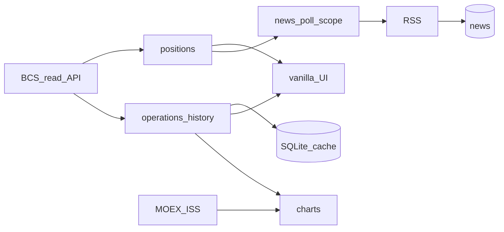

# TZ — Portfolio_News (IDEA-003)

**Карточка:** [`IDEAS.md`](../../IDEAS.md) → IDEA-003  
**План (зеркало):** [`.cursor/plans/IDEA-003-portfolio-news.md`](../../.cursor/plans/IDEA-003-portfolio-news.md)  
**Дата bootstrap 020:** 2026-08-25 · **апдейт «свой БКС»:** 2026-08-25

## Цель

Локальный терминал под **свой** портфель: новости по бумагам + сырой MOEX + **БКС read-only** (позиции, история сделок/покупок, простые графики и цифры с API). Без облака в MVP. **Не** инвест-консультант и **не** торговый бот.

## MVP / слои

### Уже есть

| Слой | Статус | Описание |
|------|--------|----------|
| A | ✅ | Каркас: FastAPI, SQLite, тикеры, RSS, CLI, toast, UI + фильтры |
| B | ✅ | Опрос по scope; фоновый poll; digest-toast |
| C | ✅ | Сырой MOEX: котировки / дивы / купоны |
| D | ✅ | БКС read-only каркас: текущие позиции `/api/holdings` |

### Новостной хвост (не блокер БКС)

| Слой | Статус | Описание |
|------|--------|----------|
| E | ⬜ | UI polish ленты (live во время poll; купоны human) — **низкий приоритет** |
| F | ⬜ | ИИ-чистка шума новостей |
| G | ⬜ | Авто-watch / Task Scheduler |
| H | ⬜ | Телефон (ntfy…) |
| I | ⬜ | Investing / эмитенты |
| J | ⬜ | Docker — только по просьбе |

### Трек «свой БКС» (сейчас в фокусе) — маленькие шаги

| Слой | Статус | Описание |
|------|--------|----------|
| K0 | 🟡 | Токен в `.env` → живые позиции; список тикеров UI ← **портфель БКС** (переключатель «БКС / Все в базе») |
| K1 | ⬜ | **История операций/сделок** из Trade API (дата/время, тикер, сторона, qty, цена, сумма) + таблица в UI |
| K2 | ⬜ | Кэш истории в SQLite (дедуп по id операции) — чтобы не долбить API и строить графики офлайн |
| K3 | ⬜ | **Графики:** цена бумаги (MOEX) + маркеры покупок/продаж; опционально equity / стоимость позиции во времени |
| K4 | ⬜ | **Разбор цифр (не советы):** avg, дата первой/последней покупки, unrealized PnL, **avg vs текущая цена** (✅), доля в портфеле |
| K5 | ⬜ | Новости/MOEX scope = только бумаги из БКС |
| K6 | ⬜ | ✅ ежедневный snapshot стоимости → график капитала |
| K7 | ⬜ | Календарь купонов/дивов **только по своим** (✅) |
| K8 | ⬜ | Фильтр операций + **экспорт CSV** (✅) |
| K9 | ⬜ | Toast на новость **только по бумагам БКС**, антиспам (✅ правила ниже) |
| KV | ⬜ | **Визуал + лёгкая анимация** UI (терминал БКС/новости): иерархия, графики, motion 2–3 осмысленных; без карнавала |

## Не делаем

- Торговля / `trade-api-write` / заявки
- Тексты «покупай / продавай / перекладывай»
- MAX / VK / Telegram вслепую; VPS; секреты в git/чат
- Смешение с воркспейсом `Инвестиции/`
- Переписывать A–D с нуля
- Тяжёлый «как Snowball SaaS» за один заход — только шаги K0→K…

**Разрешено в K:** показывать PnL/среднюю/историю **как факт с брокера или расчёт по своим сделкам** — это отображение, не рекомендация.

## Готово когда (продукт)

- [x] Новости + toast + MOEX сырой + каркас позиций БКС
- [ ] Живой список = мой БКС (K0)
- [ ] История покупок/сделок с датой-временем (K1–K2)
- [ ] Хотя бы один понятный график с маркерами сделок (K3)
- [ ] Карточка бумаги: avg / когда купил / PnL без воды (K4)
- [ ] (позже) авто-watch / телефон / ИИ-шум

## Проверка

```powershell
cd Portfolio_News
python -m portfolio_news serve
# http://127.0.0.1:8765/
```

| Что | Ожидание |
|-----|----------|
| `/api/holdings/status` | configured после `.env` |
| K1 | `/api/operations` (или аналог) → строки с datetime |
| K3 | UI график не пустой на бумаге с историей |
| `pytest tests/` | парсеры без живой сети |

## Parts ↔ код

| Part | Файлы |
|------|--------|
| [01…06](parts/INDEX.md) | ядро / новости / MOEX — как было |
| [07-bcs](parts/07-bcs.md) | позиции сейчас; расширяется K0–K6 |
| [08-ai-noise](parts/08-ai-noise.md) | слой F |
| [09-watch-phone](parts/09-watch-phone.md) | слои G–H |
| [10-bcs-terminal](parts/10-bcs-terminal.md) | **новый** — история, графики, разбор |

## Зафиксированные решения

| Вопрос | Выбор |
|--------|--------|
| Фокус сейчас | **Свой БКС** (K0→), новости не выкидываем |
| Источник позиций/сделок | BCS Trade API **read-only** |
| Графики цен | MOEX ISS (+ маркеры из истории БКС) |
| Тикеры UI (цель) | из holdings БКС, Snowball — запасной/импорт |
| Уведомления MVP | Windows toast, **осторожно** |
| Toast по новостям (K9) | только бумаги БКС; **только с сегодня**; дефолт **digest**; `off` всегда под рукой |
| БКС токен | только локальный `.env` / `Desktop\Keys\` |
| Backend | Python 3.12+, FastAPI, Uvicorn, SQLAlchemy 2, SQLite |
| Frontend **живой** | Vanilla JS + CSS в `portfolio_news/static/index.html` (отдаёт FastAPI) |
| Frontend заготовка | `frontend/` Vite + React 19 — **не трогаем**, пока UI не раздуется |
| Когда React | **после** набора инструментов (K0–K… живые: история, графики, карточки). Сейчас React = overkill. Переезд — отдельный шаг по команде |
| Графики | CDN/лёгкая lib (Chart.js или uPlot) в vanilla на K3 |
| Визуал / анимация | слой **KV** в vanilla; без карнавала |

## Поток (целевой)



## Предложения — решения пользователя (2026-08-25)

| # | Идея | Решение |
|---|------|---------|
| 1 | Snapshot → график капитала | ✅ → **K6** |
| 2 | Календарь купонов/дивов по своим | ✅ → **K7** |
| 3 | Toast на новость по своим | ✅ → **K9**, см. антиспам |
| 4 | Фильтр + CSV | ✅ → **K8** |
| 5 | Avg vs текущая | ✅ → в **K4** |

### K9 — правила toast (обязательно)

Боль был: ~50 уведомлений подряд, не остановить. Поэтому:

1. **Только с «сегодня»** (локальная дата Asia/Yekaterinburg): новости со `published`/`fetched` раньше полуночи сегодня → **в БД можно**, в toast — **нет**. Никакого догона истории.
2. **По умолчанию digest:** один toast на прогон poll («N новых по портфелю»), не N отдельных. Режим `each` — только явно, не дефолт.
3. **Только тикеры из текущего БКС holdings** (после K0/K5).
4. **Выключатель:** в UI и `.env` (`notify=off` / digest) — мгновенно глушит пуши.
5. Дедуп по URL как сейчас: повтор ссылки → тишина.

Приоритет кода: **K0 → K1 → K2 → K3(+KV график) → K4**, затем K6–K9; **KV** тянуть параллельно с UI шагов, не отдельным «редизайном всего сайта» в конце.